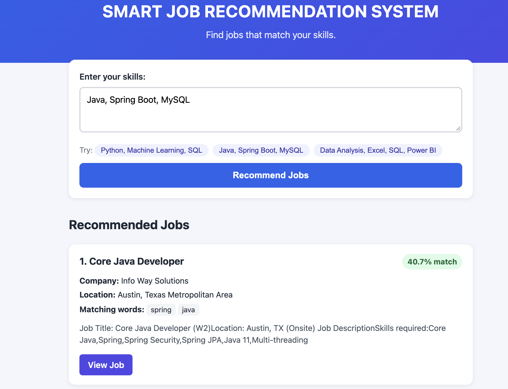
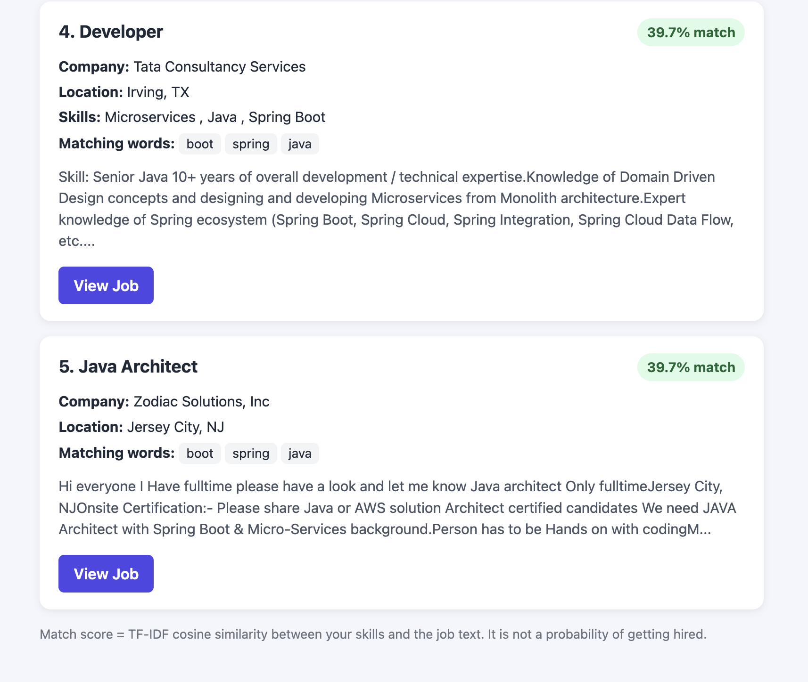
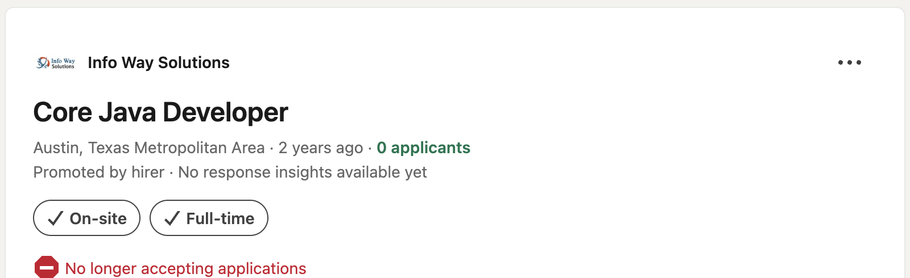

# Smart Job Recommendation System

An NLP-based job recommendation system that suggests the Top-5 most relevant job
postings based on a user's skills, using **TF-IDF** and **Cosine Similarity**.
Built with Python, scikit-learn, and Flask — no deep learning, transformers, or LLMs.

## Overview

You type in your skills (e.g. "Python, Machine Learning, SQL"), and the system
compares your skills against real job postings to find the 5 most textually
similar jobs, ranked by match percentage.

## Features

- Real-time skill-based job matching
- TF-IDF vectorization of job postings (title + skills + description)
- Cosine similarity ranking
- Top-5 recommendations with company, location, match %, and matching keywords
- Friendly error handling for empty, too-short, or unmatched input
- Responsive web interface (works on laptop and mobile)

## Tech Stack

| Layer          | Technology                               |
|----------------|-------------------------------------------|
| Language       | Python 3                                   |
| Data handling  | Pandas, NumPy                              |
| ML / NLP       | scikit-learn (TF-IDF, Cosine Similarity)   |
| Web framework  | Flask                                       |
| Frontend       | HTML, CSS, vanilla JavaScript              |
| Model storage  | Joblib                                      |

## System Architecture

```
User enters skills
        ↓
Flask web interface (POST /recommend)
        ↓
Text preprocessing (same cleaning as training data)
        ↓
TF-IDF vectorization (using the trained vectorizer)
        ↓
Cosine similarity vs. all job vectors
        ↓
Ranking by similarity score
        ↓
Top-5 job recommendations
        ↓
Displayed as cards in the web interface
```

In plain terms: the app turns your skills and every job posting into lists of
weighted words (TF-IDF), then checks how much each job's word-list "points in
the same direction" as yours (cosine similarity). The closer the direction, the
higher the match score.

## Dataset

**LinkedIn Job Postings (2023–2024)** by arshkon, from Kaggle:
https://www.kaggle.com/datasets/arshkon/linkedin-job-postings

Download it and place `postings.csv` at `data/jobs.csv`.

After cleaning (removing duplicates and postings with no usable text), a real
run on this dataset produced:

- **123,849** raw rows loaded
- **4,687** exact duplicate postings removed
- **119,162** jobs in the final trained model
- **50,000**-word vocabulary (capped by `max_features` in the TF-IDF vectorizer)
- **119,155** postings had a non-empty description
- Only **~2%** of postings had a populated `skills_desc` field — most matching
  relies on the job title and description instead

Column names are auto-detected (see `preprocessing.py`), so the app also works
with similarly-shaped job datasets that use different column names (e.g.
`job_title` instead of `title`).

> **Note:** `data/jobs.csv` is not included in this repository (see Installation).
> You must download it yourself from the link above.

## How It Works

### TF-IDF (Term Frequency – Inverse Document Frequency)
TF-IDF scores each word in a document by how often it appears in that document,
divided by how common it is across all documents. Common words like "team" or
"experience" get a low score, while distinctive skill words like "kubernetes"
or "tensorflow" get a high score. Each job posting becomes a vector of these
weighted word scores.

### Cosine Similarity
Cosine similarity measures the angle between two vectors, ignoring their length.
This matters here because a short skills query ("Python, SQL") and a long job
description should still be considered a good match if they emphasize the same
words, even though one text is much longer than the other. A score of 1.0 means
identical word emphasis; 0 means no shared words.

**Important:** the match percentage is a **text similarity score**, not a
prediction of hiring probability.

## Project Structure

```
Smart-Job-Recommendation-System/
│
├── data/
│   └── jobs.csv                 # NOT included — download separately (see Dataset)
├── model/
│   ├── tfidf_vectorizer.pkl     # generated by train_model.py
│   ├── job_vectors.pkl          # generated by train_model.py (NOT committed — see note)
│   └── jobs_clean.pkl           # generated by train_model.py
├── templates/
│   └── index.html
├── static/
│   ├── style.css
│   └── script.js
├── preprocessing.py             # shared text cleaning for training + recommending
├── train_model.py               # one-time training script
├── recommender.py               # recommend_jobs(user_skills, top_n=5)
├── app.py                       # Flask routes
├── evaluate.py                  # statistics + test profiles (no accuracy claims)
├── evaluation_report.txt        # real output from a local run (see Evaluation)
├── screenshots/                 # real screenshots of the running app
├── requirements.txt
├── LICENSE
└── .gitignore
```

**Why `job_vectors.pkl` isn't in the repo:** on the full dataset this file is
about 146 MB, which exceeds GitHub's 100 MB file limit. It's excluded via
`.gitignore` on purpose. Running `train_model.py` regenerates it locally in
under two minutes.

## Installation

```bash
git clone https://github.com/hystericalventure/SmartJobRecommendationSystem.git
python3 -m venv venv
source venv/bin/activate        # Windows: venv\Scripts\activate
pip install -r requirements.txt
```

Replace with your actual GitHub username once you've
pushed the repo. 

## How to Train the Model

1. Download the dataset (see [Dataset](#dataset)) and place it at `data/jobs.csv`.
2. Run:
```bash
python3 train_model.py
```
This loads and cleans the data, trains TF-IDF on all job postings, and saves
three files into `model/`.

## How to Run the Flask Application

```bash
python3 app.py
```
Open `http://127.0.0.1:5000` in your browser, enter your skills, and click
**Recommend Jobs**.

## Example Usage

Input: `Python, Machine Learning, SQL`

Actual output from a real run on this project's dataset (full log in
`evaluation_report.txt`):

| # | Job Title | Company | Match |
|---|-----------|---------|-------|
| 1 | AI/ML Solutions Architect (Data Analysis, SQL/Big Query, Python) | InfoVision Inc. | 35.0% |
| 2 | Developer | Tata Consultancy Services | 34.8% |
| 3 | Senior Machine Learning Engineer | Method360, Inc. | 33.9% |
| 4 | Remote P&C Insurance Data Scientist/Actuary | Pryor Associates Executive Search | 29.9% |
| 5 | Proactive Engine Architect (Data Analysis, SQL/Big Query, Python, AI/ML) | InfoVision Inc. | 29.8% |

## Sample Screenshots

**Results page** — search for `Java, Spring Boot, MySQL`:



**More results from the same search** (ranked #4 and #5):



**"View Job" link verified** — clicking through from result #1 opens the real
LinkedIn posting for that exact job (Core Java Developer, Info Way Solutions,
Austin TX), confirming the `job_posting_url` field round-trips correctly:



## Evaluation

Since there is no labeled "correct" job per skill set, this project reports
measurable statistics instead of an invented accuracy score. These numbers are
from a real local run (see `evaluation_report.txt` for the full output):

- Jobs processed: **119,162**
- Vocabulary size: **50,000**
- Non-empty descriptions: **119,155**
- Query time: **~240–490 ms** per search (measured on a MacBook Air)
- Average Top-5 similarity across 4 test profiles: **37.6%**

| Test Profile | Skills | Avg. Top-5 Match |
|---|---|---|
| Test 1 | Python, Machine Learning, SQL | 32.7% |
| Test 2 | Java, Spring Boot, MySQL | 40.1% |
| Test 3 | Data Analysis, Excel, SQL, Power BI | 40.1% |
| Test 4 | NLP, Python, Machine Learning | 37.7% |

Run `python3 evaluate.py` to reproduce this on your own machine and dataset.

A true accuracy metric (e.g. Precision@5) would require human-labeled ground
truth — a list of jobs that reviewers judged relevant for each query — which
this project does not have.

## Deployment

Not yet deployed. Recommended beginner-friendly path once you're ready:
1. Push this repo to GitHub (excluding `data/` and `model/*.pkl`, already
   handled by `.gitignore`).
2. Use a platform such as Render or Railway (free tier available).
3. Add a `Procfile` with: `web: gunicorn app:app` and add `gunicorn` to
   `requirements.txt`.
4. Since the trained model files aren't in the repo, you'll need either a
   build step that runs `train_model.py` on deploy, or to upload the `.pkl`
   files to the host's persistent storage separately — full steps to be
   confirmed once you choose a platform.

## Future Improvements

- Detect near-duplicate postings (e.g. the same internship listed under
  multiple IDs), not just exact duplicates
- Add filters for location, salary, or experience level
- Experiment with word embeddings (e.g. Word2Vec) to catch synonyms
  ("ML" ≈ "machine learning") that TF-IDF misses
- Add a feedback mechanism to collect real relevance labels for evaluation

## Limitations

- TF-IDF matches words, not meaning — it cannot tell that "ML" means
  "machine learning" unless both words appear in the text
- Only exact-duplicate postings are removed; near-duplicate listings can
  still both appear in results
- In this dataset, ~98% of postings have no `skills_desc` field, so matching
  relies mainly on job titles and descriptions
- Match percentage reflects text similarity only, not job-fit quality or
  hiring likelihood

## License

MIT License — see [LICENSE](LICENSE).
